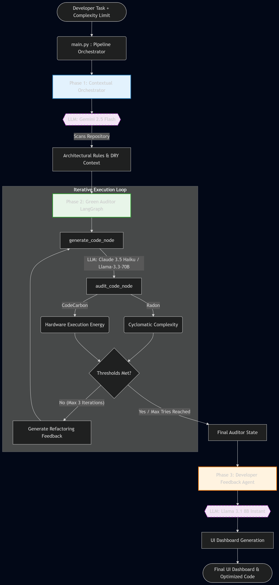

# SMART-GTD 🌱🤖

**A Multi-Agent Framework for Mitigating Energy-Induced Technical Debt through Developer Productivity and Usability Metrics**

> **Author:** Pravinkumar Gohil 

---

## 📌 Overview

The rapid adoption of Large Language Models (LLMs) in software engineering has fundamentally altered the development lifecycle, offering unprecedented velocity. However, this comes at a hidden cost: **Green Technical Debt (GTD)**. Standard AI models prioritize statistical familiarity over algorithmic efficiency, frequently generating brute-force, energy-hungry code. 

Furthermore, while AI writes code instantly, developers suffer from hidden cognitive fatigue when verifying these "black box" structures—a phenomenon termed the **Productivity-Perception Gap**.

**SMART-GTD** is a local, LangGraph-orchestrated Multi-Agent System (MAS) designed to autonomously intercept, execute, audit, and refactor AI-generated code to meet strict ecological and structural thresholds *before* it reaches the developer.

---

## 🏗️ System Architecture

The framework operates via a deterministic, stateful **Directed Acyclic Graph (DAG)**, replacing conversational agent loops with strict mathematical auditing.


*(Note: Ensure `architecture_flow.png` is placed in the root directory of this repository)*

### The Tri-Agent Pipeline:
1. **Phase 1: Contextual Orchestrator (Gemini 2.5 Flash)**
   - Performs a static traversal of the local repository.
   - Enforces the **DRY (Don't Repeat Yourself)** principle by commanding the downstream generator to reuse existing utility functions rather than hallucinating redundant logic.
2. **Phase 2: Green Auditor (Claude 3.5 Haiku / Llama-3.3-70B)**
   - The core Actor-Critic execution loop built on **LangGraph**.
   - Executes generated code in a 100% deterministic local Python sandbox.
   - Utilizes `CodeCarbon` (reading native Intel TDP sensors) to measure exact CPU execution energy (kWh).
   - Utilizes `Radon` to measure McCabe’s Cyclomatic Complexity (M).
   - Enforces **Dynamic Thresholds** (Easy: M ≤ 3.0, Medium: M ≤ 6.0, Hard: M ≤ 10.0). Fails trigger an automatic refactoring rewrite.
3. **Phase 3: Developer Feedback Agent (Llama 3.1 8B Instant)**
   - Translates raw, dense hardware telemetry into a clean, human-readable terminal UI dashboard to lower developer cognitive load and build tool trust.

---

## 🚀 Key Results (Randomized Controlled Trial)

Evaluated against a cohort of 20 software developers on a native Windows host machine, the SMART-GTD framework achieved:
* **90.47% Reduction in Execution Energy:** Dropped average execution energy from 0.00005574 kWh (Standard AI) to 0.00000531 kWh.
* **Structural Debt Mitigation:** Flattened average complexity on hard tasks (N-Queens) from M = 14.8 down to M = 8.4.
* **Increased Tool Trust:** Raised developer Tool Trust Scores from 3.23 to 4.10/5.0 by providing mathematical proof of code efficiency upfront.

---

## 🛠️ Technology Stack

* **Language:** Python 3.12
* **Multi-Agent Orchestration:** [LangGraph](https://python.langchain.com/docs/langgraph/) & [LangChain](https://python.langchain.com/)
* **Hardware Telemetry:** [CodeCarbon](https://codecarbon.io/)
* **Static Analysis:** [Radon](https://radon.readthedocs.io/en/latest/)
* **LLM APIs:** Google Gemini API, Anthropic API, Groq API

---

## ⚙️ Installation & Setup

### Prerequisites
* Native Windows OS or Linux host (Virtualization environments like WSL/Docker are **not recommended** as they block access to native CPU power sensors required by CodeCarbon).
* Python 3.12+

### 1. Clone the Repository
```bash
git clone [https://github.com/yourusername/SMART-GTD.git](https://github.com/yourusername/SMART-GTD.git)
cd SMART-GTD
